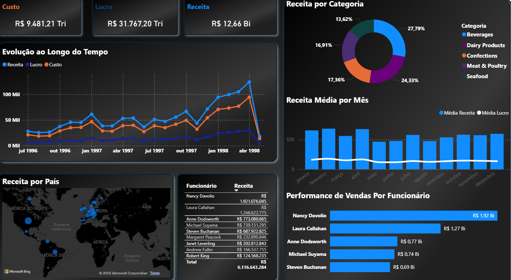

# 📊 Projeto de Análise com Python, SQL e Power BI

## 📄 Descrição do Projeto

Este projeto consiste em uma análise de dados de ponta a ponta de um conjunto de dados sobre Análise da Northwind. O pipeline de dados completo foi desenvolvido utilizando Python para a preparação e enriquecimento, SQL para a análise e extração de insights, e Power BI para a visualização interativa dos resultados.

---

### 📸 Prévia do Dashboard

---

## 🛠️ Ferramentas e Tecnologias Utilizadas

* **Linguagens:** Python, SQL
* **Bibliotecas Python:** Pandas (para ETL e manipulação), SQLite3 (para criação do banco de dados)
* **Ferramenta de BI:** Power BI (para modelagem de dados, DAX e criação do dashboard)
* **Fonte de Dados:** Northwind no Kaggle

---

## 🔄 Processo de Análise (Pipeline)

O projeto foi estruturado em três fases principais, simulando um ambiente de trabalho real:

### Fase 1: Preparação e Limpeza de Dados (ETL)
* **Script:** `preparacao_dados.py`
* Carregamento dos dados brutos a partir de múltiplos arquivos CSV.
* Limpeza de dados, tratamento de valores nulos e conversão de tipos (ex: datas).
* **Engenharia de Features:** Criação de novas colunas com métricas de negócio que não existiam nos dados originais (ex: Receita, Custo, Lucro, Tempo de Entrega, K/D Ratio).
* Carregamento dos DataFrames limpos e enriquecidos em um banco de dados SQLite, criando uma fonte de dados única e confiável.

### Fase 2: Análise e Extração de Insights (SQL)
* **Script:** `analise_sql.py`
* Realização de consultas SQL complexas com múltiplos `JOIN`s, agregações (`GROUP BY`, `SUM`, `AVG`), CTEs (`WITH`) e filtros para responder a perguntas de negócio estratégicas.
* Os resultados de cada análise foram salvos em arquivos CSV limpos, prontos para a camada de visualização.

### Fase 3: Visualização e Storytelling (Power BI)
* **Arquivo:** `ProjetoNorthwind.pbix`
* Importação dos dados analisados para o Power BI.
* Criação de um modelo de dados com relações e cardinalidade corretas.
* Desenvolvimento de um dashboard interativo com KPIs, filtros (slicers), mapas e múltiplos gráficos (barras, linhas, dispersão) para apresentar os insights de forma clara e acionável.

---

## 🏁 Como Executar o Projeto

1.  Clone este repositório.
2.  Certifique-se de ter o Python e as bibliotecas listadas instaladas.
3.  Coloque os arquivos CSV originais do dataset na pasta raiz do projeto.
4.  Execute o script `preparacao_dados.py` para criar o banco de dados SQLite.
5.  Execute o script `analise_sql.py` para gerar os CSVs de análise.
6.  Abra o arquivo `.pbix` do Power BI para explorar o dashboard final.

---
## 📬 Contato
  🔗 linkedin - https://www.linkedin.com/in/juan-da-cunha-moreno-29752a222
